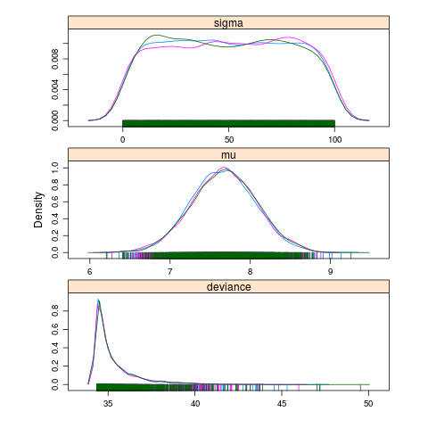

.. reproducible research tutorial file, created by ARichards

About the basic analysis pipeline
===================================

The basic procedure for fitting a model.

  1. Select a Model
  2. Write a BUGS model to a text file with your :doc:`editor </Editor>`
  3. Create a script with basic R commands like loading data
  4. Prepare the inputs for the JAGS
  5. Run the model
  6. Make plots and assess convergence
  7. Summarize the posterior
  
Some of the key words that we will become familiar with are: **posterior**, **prior**, **likelihood**, **MCMC**, **initial values**, **updates** and **convergence**

What is a model?
-----------------------------

*Estimate the mean of a normal population from a sample of measurements*

<<simple-mean>>=
somedata = rnorm(10)
print(somedata)
print(mean(somedata))
@

Models imply assumptions.  Not all models are appropriate even one as simple as the model of the mean-- think of skewed or correlated data.  Summary statistics are models.  Standard error, standard deviation, coefficient of variation etc.

If we just want to fit a common mean to :math:`mass`.

   :math:`\textrm{mass}_{i} = \mu + \epsilon_{i}`

This is the same as fitting a linear model with intercept only.   
   
<<lm-simple>>=
print(lm(somedata ~ 1))
@

Open up a editor and follow along
^^^^^^^^^^^^^^^^^^^^^^^^^^^^^^^^^^^^^^^

Generally each analysis should have its own directory-- it make sense if we want to bundle the methods, data and report.  Start from an empty `*.Rnw` template in a directory called `model-of-the-mean`.

   1.  :download:`snakes.csv <snakes.csv>`

      .. literalinclude:: snakes.csv

   2. Load the data
      
      .. code-block:: r
      
         > data <- read.csv("snakes.csv",header=TRUE,sep=',')
         > attach(data)
         > print(names(data))

   3. Plot the data     
         
      .. code-block:: r
         
         pdf("snakes-hist.pdf",height=6,width=6)
         hist(y,col='grey',main="distribution of y")
         dev.off()     
         
      .. code-block:: tex 
        
         \begin{figure}
         \begin{center}
         \includegraphics[ext=.pdf,scale = 0.9]{"snakes-hist"}
         \end{center}
         \caption{This is the figure caption}
         \end{figure}

   4. Add an example of a formula.  After all it is :math:`\textrm{\LaTeX}`.

      .. math::
  
         t_{n} &= w_{0} + w_{1}x_{1}\\
               &= \sum^{M-1}_{j=1} w_{j} \mathbf{x}\\
               &= \mathbf{w}^{T} \mathbf{x}

      Here are the commands you will need:
         * ``\usepackage{amsmath}``
         * subscript ``x_{i}`` superscript ``x^{i}`` 
         * ``\sum^{}_{}``
         * ``\mathbf{}``

         * .. code-block:: tex

              \begin{align}
                 x^{2}      &= x \times x \\
                 e^{\ln(2)} &= 2
              \end{align}

         .. note:: what if you use ``align*``?  or if you put the ``&`` at the beginning of each line?
      
   6. Show and example of how to save data to file.  The following code will help you figure it out

      .. code-block:: r
         
         a <- rnorm(10)
         b <- rnorm(10)
         ab <- data.frame(a,b)
         dump("ab",file="ab.R")
         rm(ab)
         source(file="ab.R")
         ab

   7. Edit/create your model, inits and command files

      First try this with the provided files.  Then if you wish the model and command files can be written to file from your sweave documents using the ``cat`` and ``sink`` commands. The inits file can be written with ``dump``. 

      .. code-block:: r

          cat("model{                                                                                                                                                                     
              # priors
              mu ~ dunif(0,5000)             # populaiton mean
              sigma ~ dunif(0,100)           # populaiton sd
              tau <- 1 / sigma * sigma       # Precision = 1 / variance 
             
              # likelihood                                                                                                                                                                
              for(i in 1:N){                                                                                                          
                  mass[i] ~ dnorm(mu,tau)                                                                                                                                                 
                  }                                                                                                                                                                          
              }                                                                                                                                                                           
          ",fill=TRUE,file="model-of-the-mean.txt")
          
         
      .. code-block:: r
      
         # bundle data
         jagsData <- list(mass=mass,N=length(mass))
          
         # inits function 
         inits <- function(){list(mu=rnorm(1,600),
                             sigma=runif(1,1,30))}

         # Parameters to estimate
         params <- c("mu","sigma")

         # parameters for MCMC sampling 
         nc <- 3       # Number of Chains
         ni <- 5000    # Number of draws from posterior (for each chain)
         nb <- 200     # Number of draws to discard as burn in
         nt <- 2       # Thinning rate  
      
   8. run it

       .. code-block:: r
       
          library(R2jags)
          jagsfit <- jags(jagsData,inits=inits,parameters.to.save=params,
                          model.file="model-of-the-mean.txt",n.thin=nt,
                          n.chains=nc,n.burnin=nb,n.iter=ni)
                          
                          
  
      **Not using R or R2jags?**
  
      The alternative procedures is:
      
      * save the model file
      * save the data in a file
      * create inits files
      * create a command file that specifies file names and MCMC parameters
      * make the plots by parsing the results files (CODA)
      
      .. code-block:: bash

         ~$ jags line-reg-simple.cmd
         
      or
      
      .. code-block:: r
      
         system("jags line-reg-simple.cmd")

   
   9. Plot the chains (posterior)
   
      .. code-block:: r
           
         jagsfit.mcmc <- as.mcmc(jagsfit)
         pdf("model-of-the-mean-chains.pdf")
         xyplot(jagsfit.mcmc)
         dev.off()
         pdf("model-of-the-mean-densities.pdf")
         densityplot(jagsfit.mcmc)
         dev.off()

.. figure:: model-of-the-mean-chains.png
   :scale: 90%
   :align: center
   :alt: Model of the mean chains
   :figclass: align-center

DIC is an estimate of expected predictive error (lower deviance is better).
   

Download the R script: :download:`ModelOfTheMean.R <ModelOfTheMean.R>`