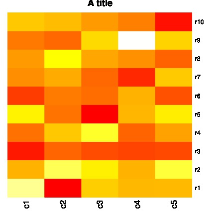

.. reproducible research tutorial file, created by ARichards

===============
Plots in Sweave
===============

A basic plots example for Sweave
________________________________

See the :doc:`/Sweave` page for more information. This file is
included as a template in :doc:`/lpEdit`.

.. literalinclude:: /../lpEdit/templates/PlotsInSweave.rnw
   :language: latex

Download: :download:`PlotsInSweave.rnw  </../lpEdit/templates/PlotsInSweave.rnw>`

Output
______

