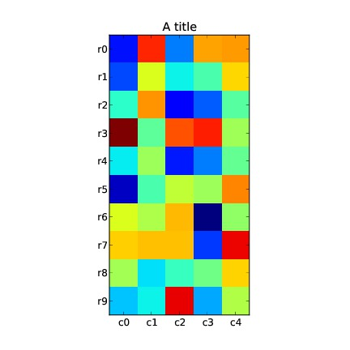

.. reproducible research tutorial file, created by ARichards

=====================
Python Plots in LaTeX
=====================

Python plot in a LaTeX document
________________________________

This file is included as a template in :doc:`/lpEdit`.  The file runs only in the editor.

.. literalinclude:: /../lpEdit/templates/PlotsInPython.nw
   :language: latex

Download: :download:`PlotsInPython.nw  </../lpEdit/templates/PlotsInPython.nw>`

Output
______

